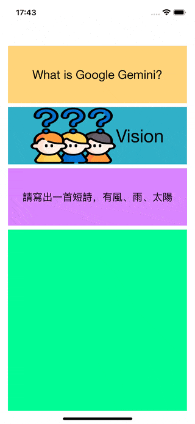

# WWSimpleAI+Gemini
[](https://developer.apple.com/swift/) [](https://developer.apple.com/swift/)  [](https://developer.apple.com/swift/) [](https://developer.apple.com/swift/)

## [Introduction - 簡介](https://swiftpackageindex.com/William-Weng)
- Simply use the functionality of Google Gemini AI.
- 簡單的使用Google-Gemini-AI功能。



### [Installation with Swift Package Manager](https://medium.com/彼得潘的-swift-ios-app-開發問題解答集/使用-spm-安裝第三方套件-xcode-11-新功能-2c4ffcf85b4b)
```js
dependencies: [
    .package(url: "https://github.com/William-Weng/WWSimpleAI_Gemini.git", .upToNextMajor(from: "1.0.0"))
]
```

### [Function - 可用函式](https://cloud.google.com/generative-ai-studio)
|函式|功能|
|-|-|
|configure(apiKey:version:model)|[設定apiKey](https://blog.jiatool.com/posts/gemini_api/)|
|chat(text:)|[執行聊天功能](https://ai.google.dev/tutorials/rest_quickstart)|
|vision(text:image:compressionQuality:)|以文字解釋圖片功能|
|stream(text:)|串流輸出文字功能|

### Example - 範例
```swift
import UIKit
import WWHUD
import WWSimpleAI_Ollama
import WWSimpleAI_Gemini

final class ViewController: UIViewController {

    private let apiKey = "<API_Key>"
    
    @IBOutlet weak var myTextView: UITextView!
    
    override func viewDidLoad() {
        super.viewDidLoad()
        initSetting()
    }
    
    @IBAction func chatAction(_ sender: UIButton) {
        
        let text = "What is Google Gemini?"
        chat(text: text)
    }
    
    @IBAction func visionAction(_ sender: UIButton) {
        
        let text = "Explain in detail what do you see in this image?"
        let image = UIImage(named: "Who")
        
        vision(text: text, image: image)
    }
    
    @IBAction func steamAction(_ sender: UIButton) {
        
        let text = "請寫出一首短詩，有風、雨、太陽"
        steam(text: text)
    }
}

private extension ViewController {
    
    func initSetting() {
        WWSimpleAI.Gemini.configure(apiKey: apiKey)
    }
    
    func chat(text: String) {
        
        WWHUD.shared.display(effect: .default, height: 256)
        
        Task {
            
            let result = await WWSimpleAI.Gemini.shared.chat(text: text)
            
            switch result {
            case .failure(let error): myTextView.text = "\(error)"
            case .success(let content): myTextView.text = "\(content ?? "")"
            }
            
            WWHUD.shared.dismiss()
        }
    }
    
    func vision(text: String, image: UIImage?) {
        
        WWHUD.shared.display(effect: .default, height: 256)

        Task {
            
            let result = await WWSimpleAI.Gemini.shared.vision(text: text, image: image)
            
            switch result {
            case .failure(let error): myTextView.text = "\(error)"
            case .success(let content): myTextView.text = "\(content ?? "")"
            }
            
            WWHUD.shared.dismiss()
        }
    }
    
    func steam(text: String) {
        
        WWHUD.shared.display(effect: .default, height: 256)

        Task {
            
            let result = await WWSimpleAI.Gemini.shared.stream(text: text)
            
            switch result {
            case .failure(let error): myTextView.text = "\(error)"
            case .success(let content): myTextView.text = "\(content.joined())"
            }
            
            WWHUD.shared.dismiss()
        }
    }
}
```
